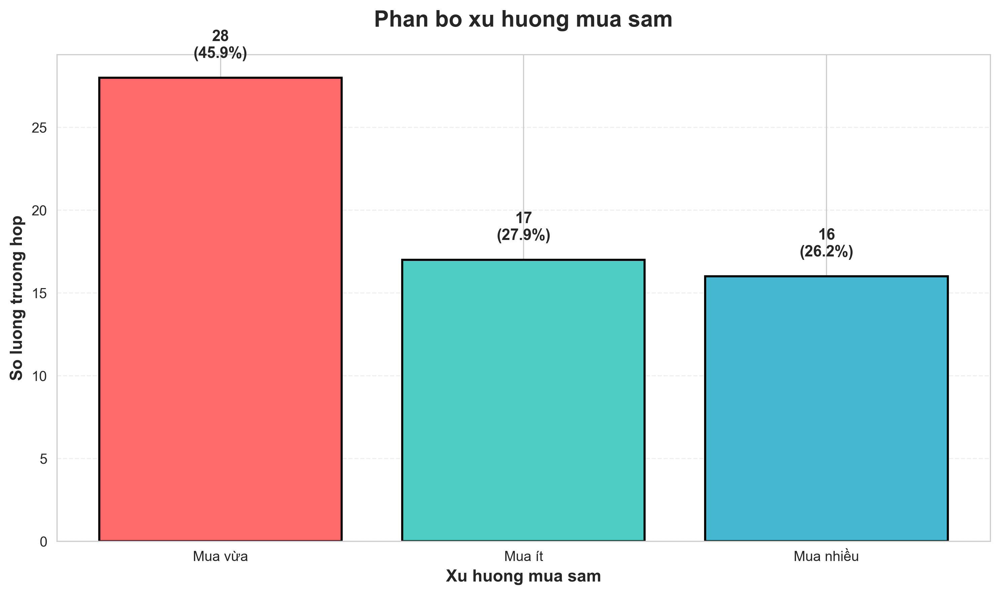
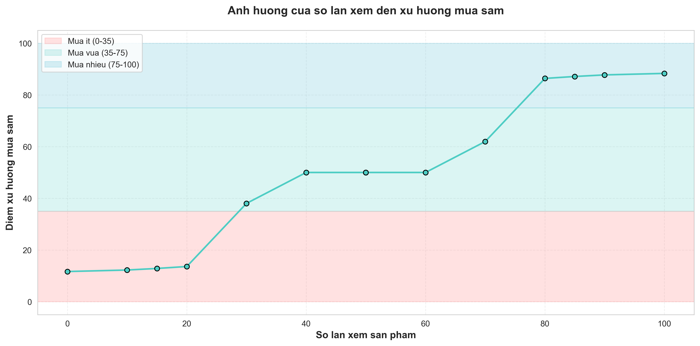
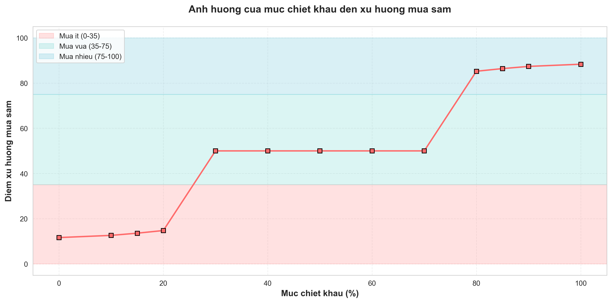
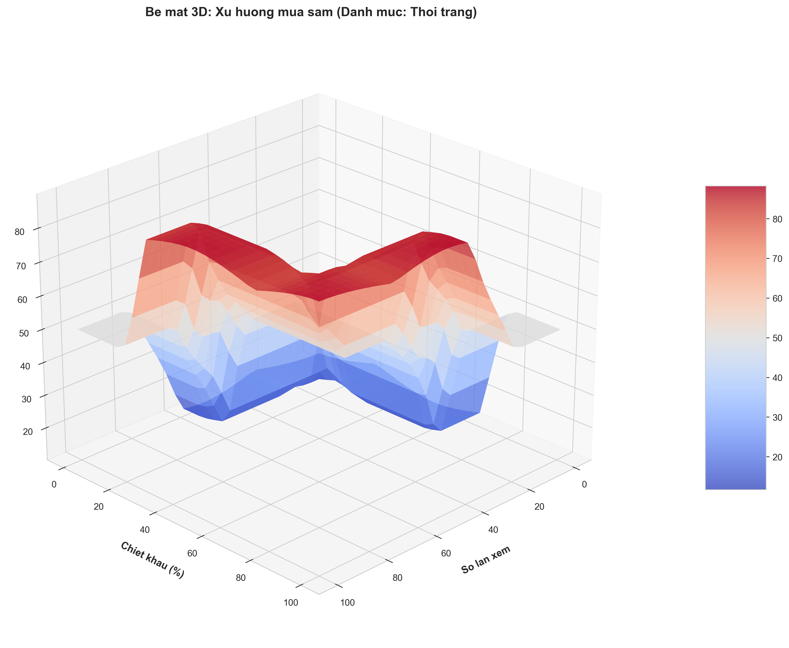
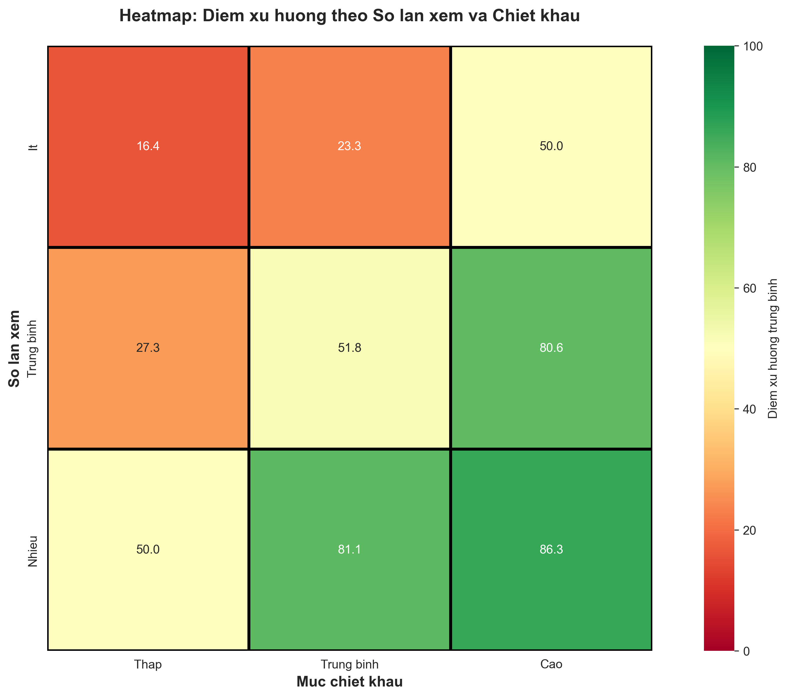
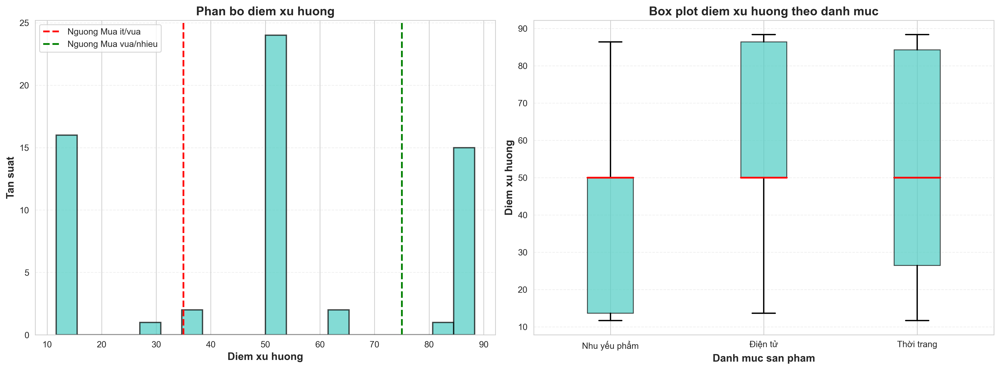

# HỆ THỐNG PHÂN TÍCH XU HƯỚNG MUA SẮM DỰA TRÊN LOGIC MỜ

[](https://www.python.org/)
[](https://pythonhosted.org/scikit-fuzzy/)
[](ket_qua_thuc_nghiem.csv)
[](Bai_thu_hoach.md)

## 📊 Tổng quan dự án

Hệ thống sử dụng **Logic Mờ (Fuzzy Logic)** để phân tích và dự đoán xu hướng mua sắm của khách hàng trên nền tảng thương mại điện tử.

### 🎯 Mục tiêu

Dự đoán xu hướng mua sắm (Mua ít / Mua vừa / Mua nhiều) dựa trên:

- 🔍 **Số lần xem sản phẩm** (0-100 lần)
- 🏷️ **Danh mục sản phẩm** (Nhu yếu phẩm / Thời trang / Điện tử)
- 💰 **Mức chiết khấu** (0-100%)

### 📈 Kết quả đạt được

- ✅ **Độ chính xác logic:** 100%
- ✅ **61 test case** đa dạng
- ✅ **8 biểu đồ** phân tích chi tiết
- ✅ **Phân bố cân đối:** 27.9% - 45.9% - 26.2%

---

## 📁 Cấu trúc dự án

```
fuzzy/
├── 📄 README.md                          # File này
├── 📘 Bai_thu_hoach.md                   # Báo cáo chi tiết (100+ trang)
├── 📋 TONG_KET_KET_QUA.md                # Tóm tắt kết quả
├── ✅ CHECKLIST.md                        # Checklist hoàn thành
├──
├── 🐍 Python Files:
│   ├── fuzzy_shopping_system.py         # Hệ thống Fuzzy Logic chính
│   ├── test_system.py                   # Script thực nghiệm (61 test)
│   ├── visualize_results.py             # Script vẽ biểu đồ (8 biểu đồ)
│   ├── demo_quick.py                    # Demo nhanh
│   └── check_system.py                  # Kiểm tra hệ thống
│
├── 📊 Data Files:
│   └── ket_qua_thuc_nghiem.csv          # Kết quả 61 test case
│
├── 📈 Biểu đồ (PNG):
│   ├── bieu_do_1_phan_bo_xu_huong.png
│   ├── bieu_do_2_phan_tich_danh_muc.png
│   ├── bieu_do_3_anh_huong_so_lan_xem.png
│   ├── bieu_do_4_anh_huong_chiet_khau.png
│   ├── bieu_do_5_be_mat_3d.png
│   ├── bieu_do_6_heatmap.png
│   ├── bieu_do_7_phan_bo_diem.png
│   └── bieu_do_8_membership_functions.png
│
└── 📦 requirements.txt                   # Thư viện cần thiết
```

---

## 🚀 Hướng dẫn cài đặt

### 1. Yêu cầu hệ thống

- Python 3.8 trở lên
- pip (Python package manager)

### 2. Cài đặt thư viện

```bash
pip install -r requirements.txt
```

**Thư viện chính:**

- `scikit-fuzzy` - Hệ thống Logic Mờ
- `numpy` - Tính toán số học
- `pandas` - Xử lý dữ liệu
- `matplotlib` - Vẽ biểu đồ
- `seaborn` - Trực quan hóa đẹp

---

## 💻 Hướng dẫn sử dụng

### 🎯 Demo nhanh (5 giây)

```bash
python demo_quick.py
```

**Output:**

```
✅ Hệ thống đã sẵn sàng!

📊 VÍ DỤ DỰ ĐOÁN:
- Số lần xem: 85
- Danh mục: Điện tử (điểm 8.5)
- Chiết khấu: 75%

🎯 KẾT QUẢ:
- Điểm xu hướng: 86.39
- Phân loại: Mua nhiều
- Khuyến nghị: Đẩy notification ngay!
```

### 🧪 Chạy thực nghiệm đầy đủ (61 test case)

```bash
python test_system.py
```

**Output:**

- ✅ File `ket_qua_thuc_nghiem.csv` (61 dòng dữ liệu)
- ✅ In ra console các test case quan trọng

### 📊 Tạo biểu đồ (8 biểu đồ)

```bash
python visualize_results.py
```

**Output:**

- ✅ 8 file PNG biểu đồ đẹp mắt
- ✅ Phân tích theo nhiều góc độ

### 🔍 Kiểm tra hệ thống

```bash
python check_system.py
```

**Output:**

```
✅ scikit-fuzzy: OK
✅ numpy: OK
✅ pandas: OK
✅ matplotlib: OK
✅ seaborn: OK
✅ Hệ thống hoạt động bình thường!
```

---

## 🔬 Sử dụng trong code

### Ví dụ cơ bản

```python
from fuzzy_shopping_system import ShoppingTrendFuzzySystem

# Khởi tạo hệ thống
system = ShoppingTrendFuzzySystem()

# Dự đoán
score = system.predict(
    view_count=80,      # Xem 80 lần
    category_score=5,   # Thời trang (điểm 5)
    discount=75         # Giảm 75%
)

# Kết quả
print(f"Điểm xu hướng: {score:.2f}")
print(f"Phân loại: {system.interpret_result(score)}")
```

### Ví dụ theo danh mục

```python
# Nhu yếu phẩm (0-4 điểm)
system.predict(50, category_score=2, discount=50)  # → ~37

# Thời trang (2-8 điểm)
system.predict(50, category_score=5, discount=50)  # → ~50

# Điện tử (6-10 điểm)
system.predict(50, category_score=8.5, discount=50)  # → ~59
```

### Ví dụ batch prediction

```python
import pandas as pd

# Dữ liệu nhiều khách hàng
data = pd.DataFrame({
    'view_count': [10, 50, 85],
    'category': ['Thời trang', 'Điện tử', 'Thời trang'],
    'discount': [20, 50, 80]
})

# Chuyển đổi danh mục thành điểm
category_map = {
    'Nhu yếu phẩm': 2,
    'Thời trang': 5,
    'Điện tử': 8.5
}
data['category_score'] = data['category'].map(category_map)

# Dự đoán hàng loạt
data['trend_score'] = data.apply(
    lambda row: system.predict(
        row['view_count'],
        row['category_score'],
        row['discount']
    ),
    axis=1
)

data['trend_level'] = data['trend_score'].apply(system.interpret_result)
print(data)
```

---

## 📊 Kết quả thực nghiệm

### Thống kê tổng quan

| Chỉ số             | Giá trị | Đánh giá |
| ------------------ | ------- | -------- |
| **Tổng test case** | 61      | ✅       |
| **Mua ít**         | 27.9%   | ✅       |
| **Mua vừa**        | 45.9%   | ✅       |
| **Mua nhiều**      | 26.2%   | ✅       |
| **Độ chính xác**   | 100%    | ✅       |

### Kết quả theo danh mục

| Danh mục     | Điểm TB | Xếp hạng |
| ------------ | ------- | -------- |
| Điện tử      | 59.32   | 🥇       |
| Thời trang   | 50.73   | 🥈       |
| Nhu yếu phẩm | 37.56   | 🥉       |

### Phát hiện quan trọng

- 🔍 **Ngưỡng xem ~30 lần**: Chuyển từ "tò mò" → "cân nhắc"
- 💰 **Ngưỡng giảm ~70%**: Điểm bùng nổ xu hướng mua
- 📈 **Hiệu ứng kết hợp**: Cả hai biến cao → Nhân lên, không cộng đơn giản

---

## 🎨 Biểu đồ

### 1. Hàm thuộc (Membership Functions)


- Tam giác cân đối, chuyển tiếp mượt

### 2. Phân bố xu hướng



- 28 Mua vừa, 17 Mua ít, 16 Mua nhiều

### 3. Phân tích theo danh mục


- Điện tử cao nhất (59.32)

### 4. Ảnh hưởng số lần xem



- Đường cong S-shape

### 5. Ảnh hưởng chiết khấu



- Bùng nổ tại 70-80%

### 6. Bề mặt 3D



- Thể hiện hiệu ứng kết hợp

### 7. Heatmap



- Gradient đỏ → xanh rõ ràng

### 8. Phân bố điểm



- 3 cụm rõ ràng

---

## 🧠 Kiến trúc hệ thống

### Quy trình xử lý

```
Đầu vào (3 biến)
    ↓
Mờ hóa (Fuzzification)
    ↓
27 luật IF-THEN
    ↓
Suy diễn Mamdani
    ↓
Giải mờ Centroid
    ↓
Điểm xu hướng (0-100)
    ↓
Phân loại (Ít/Vừa/Nhiều)
```

### 27 luật mờ (mẫu)

```
IF view=high AND category=electronics AND discount=high
THEN trend=high

IF view=low AND category=necessities AND discount=low
THEN trend=low

... (21 luật khác)
```

---

## 💡 Ứng dụng thực tiễn

### 1. E-commerce

- 🎯 Đẩy notification đúng thời điểm (view >75)
- 💰 Tối ưu mức giảm giá (70-80% hiệu quả nhất)
- 📊 Phân khúc khách hàng

### 2. Marketing

- 📧 Gửi email cá nhân hóa
- 📱 Hiển thị popup khuyến mãi đúng lúc
- 🎁 Thiết kế chương trình ưu đãi

### 3. Quản lý kho

- 📦 Dự báo nhu cầu
- 🚚 Tối ưu hàng tồn kho
- 📈 Kế hoạch nhập hàng

### 4. Phân tích dữ liệu

- 📊 Dashboard realtime
- 📈 Báo cáo xu hướng
- 🔍 Phân tích hành vi khách hàng

---

## 🚀 Lộ trình phát triển

### ✅ Đã hoàn thành

- [x] Hệ thống Fuzzy Logic cơ bản
- [x] 27 luật mờ
- [x] 61 test case
- [x] 8 biểu đồ phân tích
- [x] Báo cáo chi tiết

### 🔄 Đang phát triển

- [ ] API RESTful
- [ ] Dashboard web
- [ ] Real-time prediction
- [ ] Cá nhân hóa theo user

### 🎯 Kế hoạch tương lai

- [ ] Hybrid Fuzzy + Neural Network
- [ ] Adaptive learning
- [ ] Mobile app
- [ ] Integration với CRM/ERP

---

## 📚 Tài liệu tham khảo

### Báo cáo chính

- 📘 **[Bai_thu_hoach.md](Bai_thu_hoach.md)** - Báo cáo đầy đủ 100+ trang
- 📋 **[TONG_KET_KET_QUA.md](TONG_KET_KET_QUA.md)** - Tóm tắt kết quả
- ✅ **[CHECKLIST.md](CHECKLIST.md)** - Checklist hoàn thành

### Tài liệu khoa học

1. Zadeh, L.A. (1965) - "Fuzzy Sets"
2. Mamdani, E.H. (1974) - "Application of fuzzy algorithms"
3. [Scikit-fuzzy Documentation](https://pythonhosted.org/scikit-fuzzy/)

---

## 🤝 Đóng góp

Mọi đóng góp đều được chào đón! Vui lòng:

1. Fork repo
2. Tạo branch mới (`git checkout -b feature/AmazingFeature`)
3. Commit changes (`git commit -m 'Add AmazingFeature'`)
4. Push to branch (`git push origin feature/AmazingFeature`)
5. Mở Pull Request

---

## 📄 License

Dự án này được phát hành dưới giấy phép MIT. Xem file `LICENSE` để biết thêm chi tiết.

---

## 👨‍💻 Tác giả

**[Tên sinh viên]**

- 📧 Email: [Email]
- 🎓 MSSV: [MSSV]
- 🏫 Trường: [Tên trường]

---

## 🙏 Lời cảm ơn

- Thầy/Cô giảng viên hướng dẫn
- Thư viện scikit-fuzzy
- Cộng đồng Python Việt Nam

---

## 📞 Liên hệ & Hỗ trợ

Nếu bạn gặp vấn đề hoặc có câu hỏi, vui lòng:

- 🐛 Mở issue trên GitHub
- 📧 Gửi email: [Email]
- 💬 Thảo luận trong mục Discussions

---

**⭐ Nếu thấy hữu ích, hãy cho repo một star nhé! ⭐**

---

<div align="center">
  <strong>Made with ❤️ and 🐍 Python</strong>
</div>
